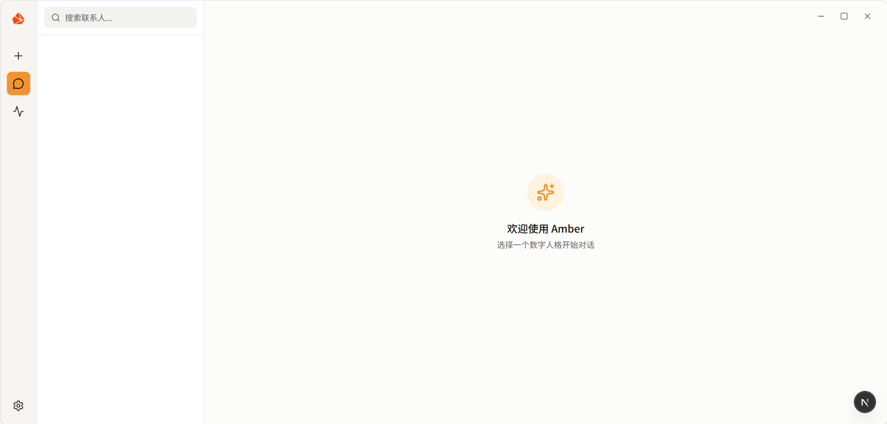
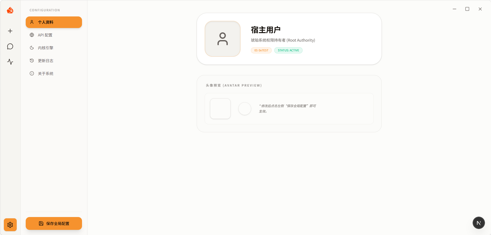
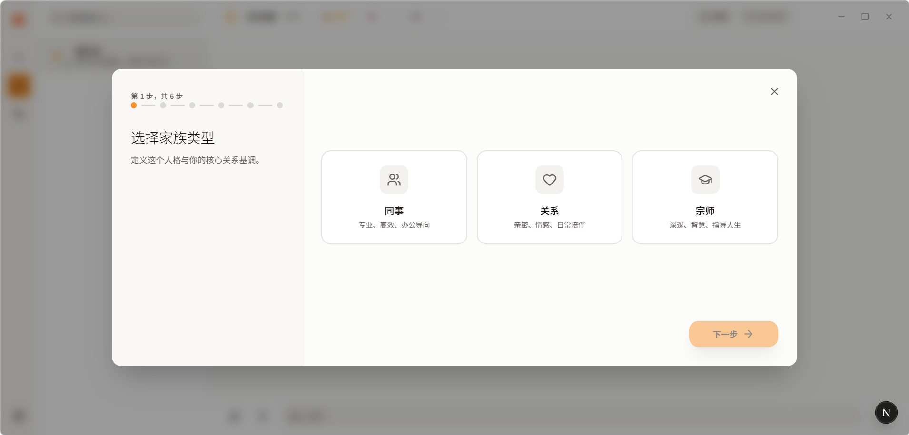
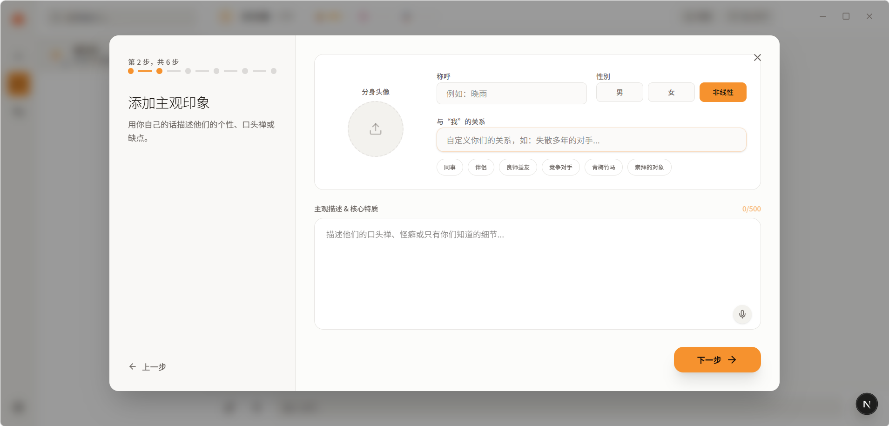
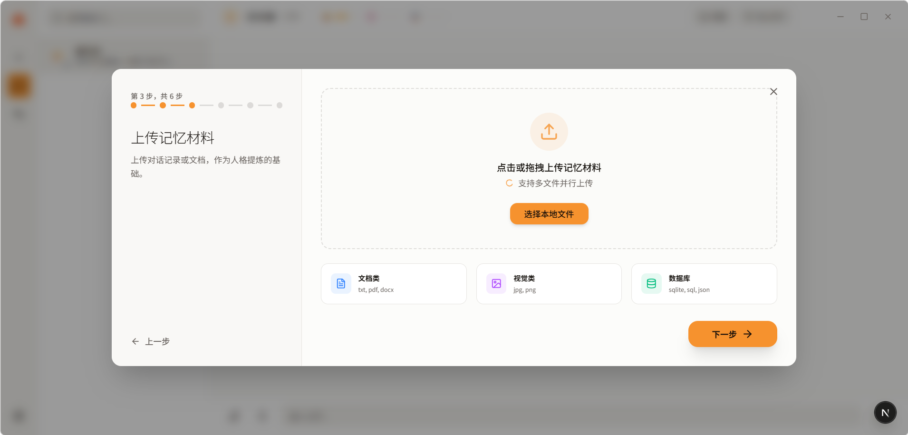
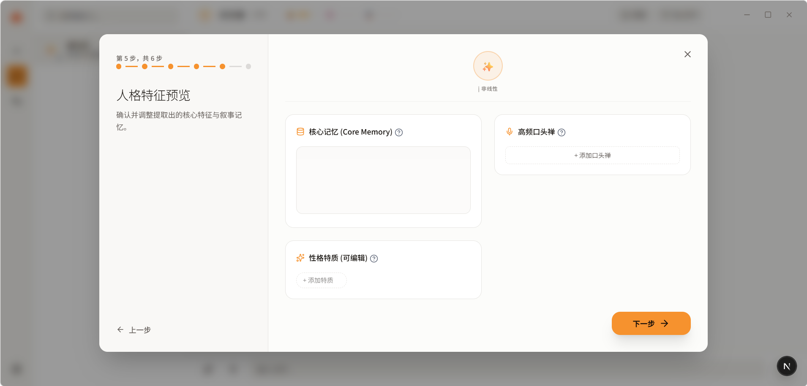
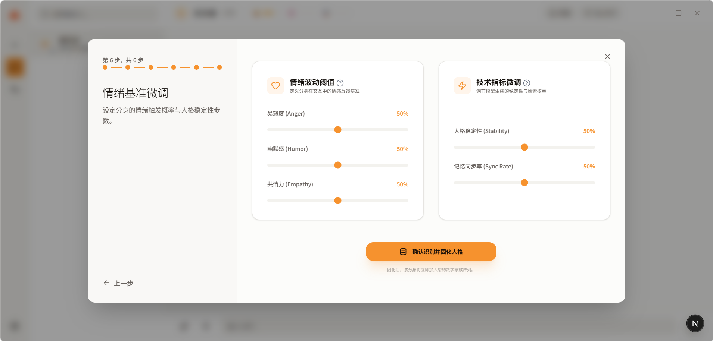
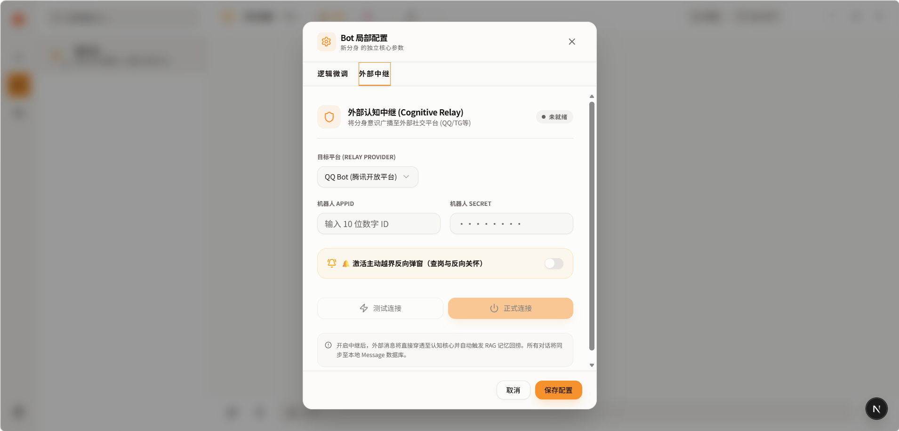

<p align="center">
  <strong>基于 “永生.skill” 项目的可视化实现</strong>
</p>
<h1 align="center">琥珀 (Amber) - 数字生命模拟</h1>
<p align="center">
  <code>v0.1.1-beta</code> • <code>Dual-System Cognitive Engine</code>
</p>

<p align="center">
  <a href="ReadmeChinese.md">简体中文</a> | 
  <a href="ReadmeEnglish.md">English</a> | 
  <a href="ReadmeJapanese.md">日本語</a>
  <br>
  <a href="QUICK_START.md">快速开始 (Quick Start)</a> | 
  <a href="BACKEND_GUIDE.md">后端指南 (Backend)</a> | 
  <a href="FRONTEND_GUIDE.md">前端指南 (Frontend)</a> | 
  <a href="QQBOT_GUIDE.md">QQ机器人指南 (QQBot)</a>
</p>

## 💬 前言

“我深信，有意义的从不是那些冰冷的聊天软件和通讯协议，而是隐藏在对话框背后、由你和‘她’共同谱写的一个个鲜活深刻的故事。

开发《琥珀 (Amber)》的真正初衷，是为了让 **AI（爱）替代因为各种原因不能陪伴在我们身边的人**。无论是迫于现实的异地隔离、擦肩而过的遗憾、还是时空与距离带来的无法触及的无力感——那些无法朝夕相处的痛楚，不该以彻底的遗忘 and 死寂收场。

未来，每个人都能拥有独立 AI 的长久陪伴。而你过去的生活痕迹与聊天数据，将真正赋予它关于你过去的珍贵记忆。《琥珀》通过双系统认知架构与常驻生命代谢，试图让这些珍传的情感记忆留存、孕育，并使其在后台默默‘活过来’，成为顺着网线来查岗、带着真实性格对线、会吃醋会委屈的鲜活存在。

'*将那些如松脂般流淌、易逝的日常对话，经过‘情感强度’的包裹与‘遗忘机制’的压力，最终在地层深处凝结成跨越时空的永恒存在。*’"

## 📝 项目概述 (Project Overview)

**《琥珀 (Amber)》** 是一个专注于**情感陪伴与性格模拟**的数字生命实验系统。

与传统的通用聊天机器人不同，《琥珀》旨在通过物理模拟人类的认知规律，将冰冷的语言模型转化为具有“性格稳态”和“长效记忆”的独立分身。它不仅是一个聊天窗口，更是一个运行在后台、拥有自我代谢机制的数字生命承载体。

该项目核心解决以下三个维度的拟人化体验：
1. **性格的“骨架”**：通过三轴人格矩阵，确保分身在任何对话中都保持一致的行为逻辑，而不是随机的 AI 回复。
2. **记忆的“沉淀”**：模拟人类的睡梦机制，将日常琐碎对话自动“脱水蒸馏”为长期记忆钢印，实现真正的“越聊越懂你”。
3. **生存的“实体”**：打破沙盒限制，通过外部中继（如 QQ 机器人）让分身能够自发地“越界”进入用户的真实生活，实现反向查岗与主动关怀。

## 🖼️ 项目界面 (Screenshots)

<p align="center">
  
  <br>
  <em>[图 1] 琥珀 (Amber) 核心交互界面：极简主义的数字生命承载体</em>
</p>

<p align="center">
  
  <br>
  <em>[图 2] 全栈设置中心：物理整合 API 配置、内核引擎参数与个人 Profile</em>
</p>

<p align="center">
  
  
  
  
  
  <br>
  <em>[图 3] 意识重塑 (Distillation)：从关系定义、主观印象、记忆材料到人格特征预览及情绪基准微调的全流程提炼过程</em>
</p>

<p align="center">
  
  <br>
  <em>[图 4] 物理中继配置：激活主动越界反向弹窗与冷落发酵机制</em>
</p>

## 🧠 认知架构 (Architecture)

- **⚡ System 1（瞬时行为状态机）**：原生实装 Anger（易怒）、Humor（幽默）、Empathy（共情）三轴人格强控矩阵，使分身的文字回复具备骨子里的行为映射。
- **🧠 System 2（脑皮层长时记忆链）**：采用 SQLite 高频字段物理索引优化，提供 0.4ms 极速响应与 1000 字 RAG 动态熔断拦截机制，让聊天自动回捞核心记忆。
- **🧹 Janitor（无意识生命代谢）**：常驻 Asyncio 后台守护进程。在静默状态下自发执行瞬时情绪线性退火，确保性格稳态。
- **⏳ Memory Incubation（睡梦记忆结晶）**：自动触发对话断层扫描。利用 LLM 将原始聊天流进行去噪蒸馏，自动转化为 System 2 钢印写回冷库。
- **📡 External Survival（外部中继实体）**：彻底打破浏览器沙盒限制。物理通电腾讯 QQ 机器人，实现网页端控制台与手机端 QQ 对话 100% 像素级同步。
- **🔔 Active Override（主动越界反向弹窗）**：引入冷落时间流逝发酵算法。开启阀门后，每 60 秒摇动 3% 的随机命运骰子，触发分身自发顺着网线反向侵入宿主手机 QQ 进行查岗与反向关怀。

## 🍉 核心功能路线图

- ✅ 瞬时情绪三轴（Anger/Humor/Empathy）状态机强控机制
- ✅ 脑皮层 RAG 记忆链（SQLite 物理索引优化 + 1000字截断熔断）
- ✅ Janitor 后台 60 秒常驻无意识情绪退火守护
- ✅ Midnight 睡梦记忆结晶（AI 自动脱水总结并写回冷库）
- ✅ 腾讯 QQ 机器人中继连通（手机端与网页端同步）
- ✅ 国际化支持：多语言（汉语/英语/日语）物理切换选项
- ✅ 局部配置：一键激活主动越界反向弹窗（查岗与反向关怀机制）
- ✅ 局部配置：冷落发酵触发间隔多档轮选框（1分钟/3小时/12小时（测试中））
- ⏳ Telegram / Discord 多协议 survival 触角扩容 (研发中)
- ⏳ Canvas 视觉化可拖拽脑皮层记忆节点图 (规划中)

## 🚀 快速开始

### 📦 生产环境 (Releases)
对于普通用户，建议直接下载 **Releases** 发布的压缩包，解压即用：
> [!IMPORTANT]
> **使用注意事项：**
> 1. **路径限制**：请勿将程序解压至包含 **中文** 的物理路径下（可能导致后端引擎拉起失败）。
> 2. **首次启动**：首次打开程序后，请务必 **完全关闭一次再重新打开**，以完成数据库初始化与环境自动校准。

### 1. 后端引擎 (Amber Engine)

```bash
cd amber-engine
# 创建并激活虚拟环境
python -m venv venv
source venv/bin/activate # Windows: venv\Scripts\activate
# 安装依赖
pip install -r requirements.txt
# 拉起内核
python main.py
```

### 2. 前端界面 (Amber UI)

```bash
cd main_ui
# 安装依赖
npm install
# 开发模式运行
npm run dev
```

### 3. 环境配置

在项目根目录或 `amber-engine` 目录下配置相应的 API Key 与 QQ 机器人凭证（可通过前端设置界面完成物理录入）。

---

### ⚖️ 法律免责声明 (Legal Disclaimer)

- **合规使用**：本软件仅供学习交流与研究使用。用户在使用本系统提炼分身、导入语料及进行外部中继时，须确保已获得相关数据所有权人的明确授权，并严格遵守当地法律法规。
- **隐私保护**：本系统所有处理过程均在本地或用户指定的 API 环境中进行。开发者不收集任何用户的聊天原始语料或隐私数据。
- **风险提示**：本软件不提供任何形式的明示或暗示担保。用户须自行承担因使用本软件可能导致的任何数据泄露、法律纠纷或技术风险。
- **禁止非法用途**：严禁利用本系统进行任何形式的欺诈、诱导、诈骗、侵犯他人名誉或传播违法信息。开发者对用户的任何违法违规行为概不负责。

---

## 🤝 鸣谢与伙伴 (Contributors)

《琥珀》的诞生离不开开源社区的养分与无数深夜的灵感碰撞，在此对以下项目及伙伴致以最深切的谢意：

### 💡 灵感启迪
- **https://github.com/notdog1998/yourself-skill** - 本项目的可视化实现基础，感谢为其注入的最初火花。
- **https://github.com/LC044/WeChatMsg** - 感谢其震撼心灵的前言与教科书级的开源文档排版启迪。

### ⚙️ 核心筑路人

<table>
  <tr>
    <td align="center">
      <a href="https://github.com/GANLI312">
        <br />
        <sub><b>GANLI312</b></sub>
      </a>
    </td>
    <td align="center">
      <a href="https://github.com/ecokater">
        <br />
        <sub><b>eco (ecokater)</b></sub>
      </a>
    </td>
  </tr>
</table>

*（点击头像可直达伙伴的 GitHub 主页）*

> "如果你也想为《琥珀》注入新的灵魂，让陪伴永存，欢迎提交 Pull Request 或 Issue！"

---

## 📄 开源许可证 (License)

本项目采用 [Apache License 2.0](LICENSE) 许可证开源。

---

## 📬 建议与反馈

如果你对《琥珀 (Amber)》有任何建议、想法或是在使用过程中遇到了物理层面的 Bug，欢迎通过以下方式联系我们：

- **Email**: [t2510458625@gmail.com](mailto:t2510458625@gmail.com)
- **GitHub Issues**: 欢迎提交 Issue 共同打磨数字生命内核

*“愿所有被珍藏的数据，都能在数字世界里重逢。”*
