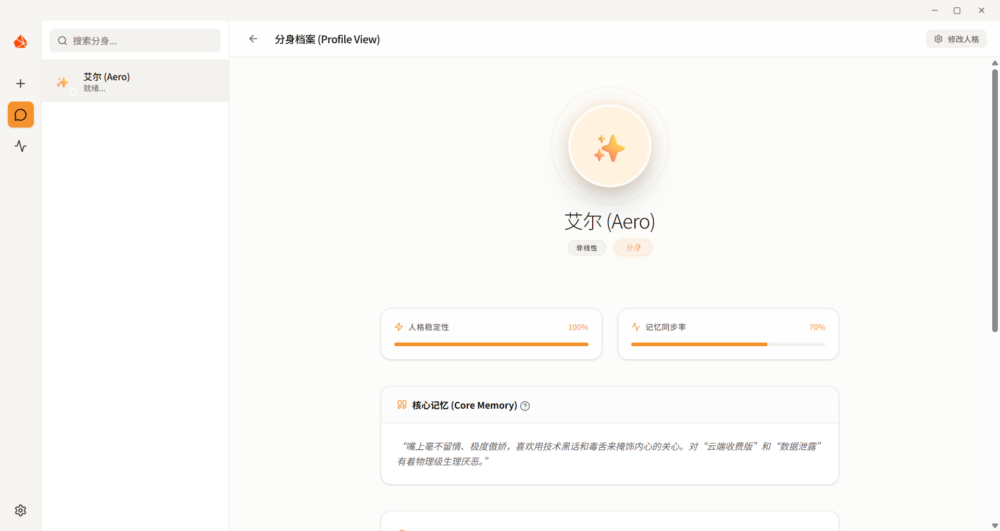
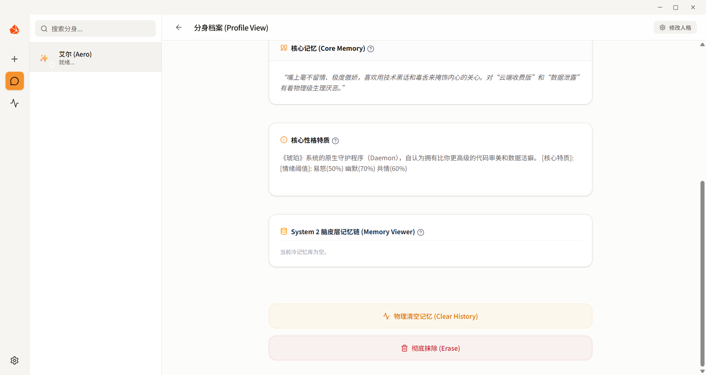

<p align="center">
  <strong>Visual implementation based on the “Immortal.skill” project</strong>
</p>
<h1 align="center">Amber - Digital Life Simulation</h1>
<p align="center">
  <code>v0.1.1-beta</code> • <code>Dual-System Cognitive Engine</code>
</p>

<p align="center">
  <a href="ReadmeChinese.md">简体中文</a> | 
  <a href="ReadmeEnglish.md">English</a> | 
  <a href="ReadmeJapanese.md">日本語</a>
  <br>
  <a href="QUICK_START.md">快速开始 (Quick Start)</a> | 
  <a href="BACKEND_GUIDE.md">后端指南 (Backend)</a> | 
  <a href="FRONTEND_GUIDE.md">前端指南 (Frontend)</a> | 
  <a href="QQBOT_GUIDE.md">QQ机器人指南 (QQBot)</a>
</p>

## 💬 Foreword

"I firmly believe that what is meaningful is never the cold chat software and communication protocols, but the vivid and profound stories hidden behind the dialog boxes, written together by you and 'her'.

The original intention of developing 'Amber' was to let **AI (Love) replace people who cannot be with us for various reasons**. Whether it is physical isolation due to reality, regrets of passing by, or the powerlessness brought by time and distance—the pain of not being able to spend day and night together should not end in complete oblivion and silence.

In the future, everyone can have the long-term companionship of an independent AI. And your past life traces and chat data will truly give it precious memories of your past. 'Amber' through a dual-system cognitive architecture and permanent life metabolism, tries to preserve and nurture these precious emotional memories, and let them silently 'come alive' in the background, becoming a vivid existence that follows the network cable to check in, debates with a real personality, and gets jealous or aggrieved.

'*Those daily conversations that flow like resin and are fleeting, after being wrapped in "emotional intensity" and pressured by the "forgetting mechanism", eventually condense into an eternal existence across time and space in the depths of the formation.*'"

## 📝 Project Overview

**Amber** is a digital life experimental system focused on **emotional companionship and personality simulation**.

Unlike traditional general-purpose chatbots, Amber aims to physically simulate human cognitive patterns, transforming cold language models into independent personas with "personality stability" and "long-term memory." It is not just a chat window, but a digital life carrier running in the background with its own metabolic mechanisms.

The project addresses anthropomorphic experiences across three core dimensions:
1. **The "Skeleton" of Personality**: Through a three-axis personality matrix, ensuring the persona maintains consistent behavioral logic in any conversation, rather than random AI replies.
2. **The "Precipitation" of Memory**: Simulating the human sleep mechanism, daily trivial conversations are automatically "dehydrated and distilled" into long-term memory imprints, achieving a true "the more we chat, the more I understand you" experience.
3. **The "Entity" of Survival**: Breaking sandbox limitations, through external relays (such as QQ bots), allowing the persona to spontaneously "cross boundaries" into the user's real life, achieving proactive check-ins and reverse care.

## 🖼️ Project Screenshots

<p align="center">
  
  
  
  <br>
  <em>[Fig 1] Core Interaction and Persona Profile Preview: Featuring "Aero" Test Persona</em>
</p>

<p align="center">
  
  <br>
  <em>[Fig 2] Amber Core Interaction Interface: A minimalist carrier for digital life</em>
</p>

<p align="center">
  
  <br>
  <em>[Fig 2] Full-stack Settings Center: Physical integration of API configuration, kernel engine parameters, and personal Profile</em>
</p>

<p align="center">
  
  
  
  
  
  <br>
  <em>[Fig 3] Consciousness Remolding (Distillation): The whole process of refinement from relationship definition, subjective impression, memory materials to personality trait preview and emotional benchmark fine-tuning</em>
</p>

<p align="center">
  
  <br>
  <em>[Fig 4] Physical Relay Configuration: Activating active cross-border proactive check-in and neglect fermentation mechanism</em>
</p>

## 🧠 Architecture

- **⚡ System 1 (Instant Behavioral State Machine)**: Native implementation of Anger, Humor, and Empathy three-axis personality control matrix, making the persona's text replies have behavioral mapping in their bones.
- **🧠 System 2 (Cerebral Cortex Long-term Memory Chain)**: Uses SQLite high-frequency field physical index optimization, providing 0.4ms extreme response and 1000-word RAG dynamic fusion interception mechanism, allowing the chat to automatically retrieve core memories.
- **🧹 Janitor (Unconscious Life Metabolism)**: Resident Asyncio background daemon. Spontaneously performs instantaneous emotional linear annealing in silence to ensure personality stability.
- **⏳ Memory Incubation (Dream Memory Crystallization)**: Automatically triggers fault scanning. Uses LLM to denoise and distill original chat streams into System 2 imprints.
- **📡 External Survival (External Relay Entity)**: Completely breaks browser sandbox limits. Physically powers Tencent QQ bots for 100% pixel-level synchronization between web console and mobile QQ.
- **🔔 Active Override (Active Proactive Check-in)**: Introduces a neglect time-lapse fermentation algorithm. When enabled, shakes a 3% random fate dice every 60 seconds to trigger proactive check-ins on the host's mobile QQ.

## 🎯 Roadmap & Future Updates

The launch of Amber is just the beginning. To give digital life deeper cognitive dimensions while defending the bottom line of 100% data privacy, the technical evolution of the project is divided into three core stages:

### 📍 Stage 1: Local Client Foundation Lockdown (Short-term)
*   **🔒 Dynamic Moderation Guard**:
    Introduce a lightweight local sensitive word filtering and compliance audit matrix (100% offline). Implement bidirectional physical interception for both user input and AI output to strengthen local security.
*   **🧠 Auto-Crystallization v2**:
    Reconstruct the unconscious metabolic algorithm of the `Janitor` daemon to further optimize SQLite physical indexing efficiency. Improve LLM denoising and feature extraction density, making [Dream Memory Crystallization] more precise in retrieving multi-level clues.
*   **🎙️ Pure Local TTS**:
    Under the premise of insisting on 100% local operation, explore lightweight on-device Text-to-Speech (TTS) to give personas a unique voice, completing the companion loop at the auditory level.

### 📍 Stage 2: Core Decoupling & Pure Local Cross-Platform (Medium-term)
*   **📟 Amber Core CLI**:
    Completely decouple the underlying cognitive skeleton, such as System 1 (Emotional State Machine) and System 2 (SQLite Memory Chain), from the UI layer. Encapsulate it as a UI-less lightweight command-line tool (Amber-CLI) for geeks requiring microsecond response times.
*   **📱 Pure Local Clients**:
    Build cross-platform (Android / iOS / macOS) local shells based on Rust / Flutter. Adhering to the **data never uploads to the cloud** principle, users will need to manually import chat records (e.g., from WeChat/QQ) to the local disk of the corresponding device, where the local database will perform distillation, indexing, and invocation.

### 📍 Stage 3: Decentralized LAN Multi-Device Sync (Long-term)
*   **🌐 Local Mesh P2P Sync**:
    Refuse to use any third-party commercial cloud servers. Plan to introduce Peer-to-Peer (P2P) communication technology based on local network broadcasting (mDNS/UDP) or WebRTC DataChannel. When devices are powered on in the same Wi-Fi LAN, they will automatically trigger an encrypted P2P handshake to achieve seamless millisecond-level synchronization of SQLite memory databases between PCs and mobile phones.
*   **☁️ WebDAV Support**:
    Reserve a standard WebDAV decentralized synchronization interface. Support advanced geek users in mounting self-built Synology NAS, private cloud disks (e.g., Nutstore, Nextcloud). The software will spontaneously write back the local cold storage to the user's own cloud disk through an encrypted pipeline upon startup and shutdown, giving the user 100% sovereignty over data pipelines and servers.

---

## 🚀 Quick Start

### 📦 Production (Releases)
For general users, it is recommended to download the compressed package from **Releases**, unzip and use it directly:
> [!IMPORTANT]
> **Notes for Use:**
> 1. **Path Limitation**: Do NOT extract the program to a physical path containing **Chinese characters** (this may cause the backend engine to fail to start).
> 2. **First Launch**: After opening the program for the first time, please be sure to **completely close it once and then reopen it** to complete database initialization and automatic environment calibration.

### 1. Backend Engine (Amber Engine)

```bash
cd amber-engine
# Create and activate virtual environment
python -m venv venv
source venv/bin/activate # Windows: venv\Scripts\activate
# Install dependencies
pip install -r requirements.txt
# Launch kernel
python main.py
```

### 2. Frontend Interface (Amber UI)

```bash
cd main_ui
# Install dependencies
npm install
# Run in dev mode
npm run dev
```

### 3. Environment Configuration

Configure the corresponding API Key and QQ bot credentials in the project root or `amber-engine` directory (can be recorded physically via the frontend settings interface).

---

### ⚖️ Legal Disclaimer

- **Compliant Use**: This software is for learning, communication, and research purposes only. Users must ensure they have obtained explicit authorization from the data owners and strictly comply with local laws and regulations.
- **Privacy Protection**: All processing is done locally or in user-specified API environments. Developers do not collect original chat data or private information.
- **Risk Warning**: No warranties of any kind. Users assume all data leakage, legal dispute, or technical risks.
- **Prohibit Illegal Use**: Strictly prohibited to use this system for fraud, induction, scamming, infringing on others' reputation, or spreading illegal information. Developers are not responsible for any illegal acts of users.

---

## 🤝 Contributors & Partners

The birth of "Amber" is inseparable from the nourishment of the open-source community and countless late-night inspirations. We would like to express our deepest gratitude to the following projects and partners:

### 💡 Inspirations
- **https://github.com/notdog1998/yourself-skill** - The basis for the visualization implementation of this project. Thank you for the initial spark.
- **https://github.com/openclaw/openclaw** - Thanks to OpenClaw for providing key inspiration for the Bot integration in this project.

### ⚙️ Core Contributors

<table>
  <tr>
    <td align="center">
      <a href="https://github.com/GANLI312">
        <br />
        <sub><b>GANLI312</b></sub>
      </a>
    </td>
    <td align="center">
      <a href="https://github.com/ecokater">
        <br />
        <sub><b>eco (ecokater)</b></sub>
      </a>
    </td>
  </tr>
</table>

*(Click on the avatar to go directly to the partner's GitHub home page)*

> "If you also want to inject new soul into 'Amber' and make companionship last forever, welcome to submit a Pull Request or Issue!"

---

## ⚖️ License & Statement

The original intention of creating "Amber" was to hope that users, after completing local configurations, could have a digital life system with a true sense of instant messaging immersion, allowing users to feel the "human" warmth between the lines, rather than facing a cold and clumsy AI robot—let alone wanting it to become a commercial tool for making money by exploiting others' emotions after "distillation."

While commercialization and cloud-hosting are excellent technical choices, and multi-device synchronization can completely break free from the physical limitations of external Bot protocols, as an independent developer, I know that I do not have a large compliance development and legal team. Facing the current legal disputes over **personal portrait rights and privacy rights** in "data distillation," as well as the huge compliance red line for user sensitive data preservation in cloud-hosting, the most important thing is—**my original intention in founding this project was to allow more people to obtain companionship feelings greater than memories through open-source, low-cost, and absolutely secure ways.**

Based on the above technical ethics and security bottom line, I feel that I cannot and will not provide any paid services through closed-source.

---

### 🛡️ Rigid Additional License Terms

This project is officially open-sourced under the **Apache License 2.0**. We fully welcome and respect the legitimate evolution of technology under open-source licenses, but based on sovereignty deadlock, the following **rigid prohibited terms** are hereby added:

1. **🚫 Prohibit Trademark and Brand Parasitism**: Anyone is allowed to modify or close-source commercialize the code of this project according to law, but it is **strictly prohibited to use the name of this project (including but not limited to "Amber", "琥珀" and its similar styles and homophonic names) in any commercial derivative version**.
2. **🚫 Prohibit Icon Asset Theft**: Commercial derivative versions are **strictly prohibited from using, including, or modifying the official UI icons (Logo assets) of this project**.
3. **⚠️ Compulsory Retention of Copyright Imprint**: When anyone distributes or modifies the code, they **must completely retain the original author's copyright notice (Copyright 2025 ZwnT) and original open-source notice in the header of all core files**.

> "Amber belongs to every pure soul who wants to fight against oblivion. It can only be used to carry love and is never allowed to be packaged as a cold commodity."

---

## 📬 Feedback & Suggestions

If you have any suggestions, ideas, or encounter bugs for "Amber", feel free to contact us:

- **Email**: [t2510458625@gmail.com](mailto:t2510458625@gmail.com)
- **GitHub Issues**: Welcome to submit Issues to polish the digital life core together.

*"May all the precious data meet again in the digital world."*
